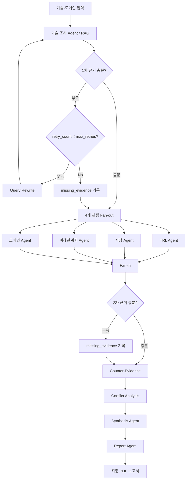

# Subject

본 프로젝트는 데이터센터·클라우드 환경에서 발생하는 KV Cache 메모리 문제를 해결하기 위한 기술을 비교 평가하는 Agentic RAG 프로젝트이다. 두가지 HW 방식의 기술을 선정하고, 기술 성숙도(TRL), 시장성, 이해관계자, 데이터센터 적용성 관점에서 각각의 특징과 한계를 분석한다.

## Overview

- **Objective** : ITME와 CXL-PIM을 여러 관점에서 비교 평가하고, 각 평가 결과의 근거와 출처를 포함한 PDF 보고서를 생성한다.
- **Method** : Multi-Agent(Distributed) 구조와 Agentic RAG를 사용한다.
- **Tools** : OpenAI Responses API, Tavily Search, PyMuPDF를 사용한다.

## Selected Technologies

- **HW : ITME** — CXL과 NVMe를 활용한 계층형 메모리 구조에 prefetch 제어를 적용하여 KV Cache 저장 공간을 확장하고, GPU와 외부 메모리 사이의 데이터 이동을 관리하는 기술이다.
- **HW : CXL-PIM** — CXL memory 내부의 PNM 가속기에서 token page selection과 attention 연산을 수행하여 GPU 메모리 사용량과 데이터 이동 비용을 줄이는 기술이다.

## Features

- 핵심 및 보조 논문 PDF 7편을 로딩하고, 검색 결과에서 원본 문서와 페이지를 확인할 수 있도록 출처 메타데이터를 함께 저장한다.
- Dense 검색과 BM25 검색 결과를 RRF로 결합하여 Hybrid Retrieval을 구성한다.
- 기술 조사, TRL, 시장, 이해관계자, 도메인 평가를 각각 별도의 Agent로 구성한다.
- TRL, 시장, 이해관계자, 도메인 평가 Agent는 병렬로 실행하고, 평가가 끝난 뒤 Fan-in 방식으로 결과를 통합한다.
- 필요한 근거가 부족한 경우 부족한 항목을 기준으로 Query를 다시 작성하고, 제한된 횟수 안에서 재검색한다.
- 검색된 근거는 인용문, 출처, 기술, 수치, 실험 조건을 함께 확인하며, 검증 기준을 통과하지 못한 근거는 제외 사유를 기록한다.
- 최종 평가 결과는 한국어 A4 형식의 PDF 보고서로 생성한다.
- **확증 편향 방지 전략** : 기술과 평가 기준별로 검색을 분리하고, 기존 주장과 반대되는 근거를 추가로 검색한다. 서로 다른 결과가 확인된 경우 Conflict 분석을 수행하며, 근거가 부족하거나 직접 비교하기 어려운 항목은 최종 보고서에 한계로 남긴다.

## Tech Stack

- **Framework** : LangGraph, LangChain
- **LLM/Generator** : `gpt-4.1-mini`
- **LLM/Judge** : `gpt-4.1-mini`
- **Retrieval** : NumPy Vector Index + BM25 + RRF — Hybrid Hit Rate@10 `1.000`, MRR@10 `0.617`
- **Embedding** : `intfloat/multilingual-e5-base`
- **Web Search** : Tavily Search
- **PDF Parsing/Report** : PyMuPDF, ReportLab

> Retrieval 성능은 정답 페이지를 직접 라벨링한 내부 질의 8개를 기준으로 측정했다.

## Agents

- **Technical Research Agent** : 핵심 논문을 RAG로 검색하고, 기술의 작동 원리와 성능, 실험 조건, 한계에 대한 근거를 추출한다.
- **TRL Evaluation Agent** : 논문, PoC, Prototype, 실제 적용 및 상용화 여부를 바탕으로 기술 성숙도를 평가한다.
- **Market Evaluation Agent** : 제품화 여부, 실제 도입 사례, 관련 생태계와 시장 규모 및 성장성을 조사한다.
- **Stakeholder Evaluation Agent** : 개발자, 도입 기업, 투자 업계 등 이해관계자별 기대 효과와 우려 사항을 분석한다.
- **Domain Evaluation Agent** : 데이터센터 환경을 기준으로 용량, 성능, 데이터 이동, 확장성, 비용과 구축 복잡도를 평가한다.
- **Counter-Evidence/Conflict Node** : 각 평가에서 나온 주요 주장과 반대되는 근거를 추가로 검색하고, 서로 다른 주장이나 결과가 나온 조건을 정리한다.
- **Synthesis Agent** : 각 관점의 평가 결과를 종합하여 공통점, 차이점, Trade-off와 분석 한계를 정리한다.
- **Report Agent** : 검증된 State를 바탕으로 최종 보고서를 작성하고, 본문에 사용된 근거와 참고문헌을 연결한다.

## Architecture



## Directory Structure

```text
├── data/                  # 논문 PDF, 문서 manifest, 검색 평가 질의
├── agents/                # 기술·TRL·시장·이해관계자·도메인·종합·보고서 Agent
├── nodes/                 # 근거 검사, 재검색, 반증, Conflict 노드
├── rag/                   # PDF 로딩, 청킹, 임베딩, Hybrid Retrieval
├── tools/                 # LLM, Web Search, Query Rewrite, PDF 생성 도구
├── tests/                 # 자동 테스트
├── outputs/               # PDF 보고서, State, 로그
├── app.py                 # CLI 실행 스크립트
├── graph.py               # LangGraph Workflow
├── state.py               # ResearchState Schema
└── README.md
```

## Usage

```bash
# 의존성 설치
uv sync --frozen --extra rag --extra dev

# .env에 OPENAI_API_KEY, TAVILY_API_KEY 설정 후 실행
.venv/bin/python app.py --check
.venv/bin/python app.py --index
.venv/bin/python app.py --run

# 외부 API 없이 Graph 흐름 확인
.venv/bin/python app.py --demo
```

최종 보고서는 `outputs/날짜-실행ID/report.pdf`에 저장된다.

## Contributors

- **백소현** : RAG 파이프라인과 기술 조사 Agent를 구현했다.
- **윤정수** : TRL·시장 평가 Agent를 구현하고 Web Search 근거를 구조화했다.
- **전상진** : 이해관계자·도메인 평가 Agent를 구현하고 평가 기준을 정리했다.
- **전현찬** : LangGraph, State, Fan-out/Fan-in을 포함한 전체 Workflow를 구현했다.
- **정진우** : Evidence 검사, Query Rewrite, Counter-Evidence, Conflict Node를 구현했다.
- **정현주** : Synthesis·Report Agent를 구현하고 Reference 연결과 통합 테스트를 담당했다.
