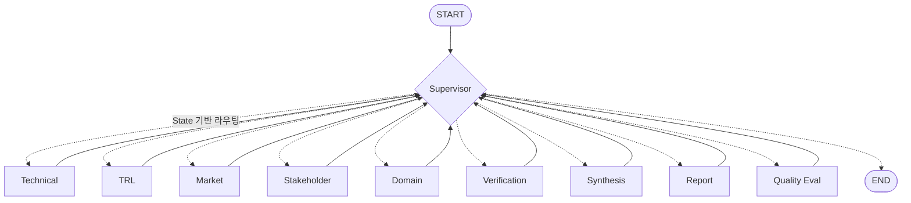

# KV Cache 최적화 기술 비교 평가

## Subject

본 프로젝트는 KV Cache 최적화 기술을 소프트웨어·시스템 진영과 하드웨어 진영에서 각각 선정하고, 기술 성숙도·시장·이해관계자·데이터센터 도메인 관점에서 비교 평가하는 **Supervisor 패턴 기반 Agentic RAG** 프로젝트이다.

## Overview

- **Objective** : ITME와 CXL-PIM을 복수 관점에서 비교하고, 주장별 근거와 출처를 포함한 PDF 보고서를 생성한다.
- **Pattern : Supervisor** — **선정 이유** : 관점별 근거 확보 상태가 서로 다르므로, 중앙 Supervisor가 State를 읽고 필요한 Agent만 선택하거나 부족한 항목만 재조사하는 구조가 적합하다.
- **동적 처리** : 고정된 노드 순서나 정해진 스텝 수를 사용하지 않는다. Supervisor가 현재 State의 수집된 관점, 근거 충분도, Agent 실패 여부, 품질 평가 결과를 매 단계 확인하여 `add_conditional_edges`의 다음 대상을 결정한다. 근거가 부족하면 해당 기술 또는 관점 Agent만 재호출하고, 품질 평가에 실패하면 보고서나 비어 있는 관점을 허용 횟수 안에서 다시 처리한다.

## Selected Technologies

- **SW : ITME** — **선정 이유** : 예측 가능한 KV Cache 접근을 이용해 사용자 수준 prefetch API와 DMA/RDMA 데이터 이동을 제어하는 시스템 소프트웨어 관점의 최적화를 평가할 수 있다. ITME는 CXL-hybrid memory와 NVMe를 포함하는 HW/SW co-design이지만, 본 비교에서는 메모리 배치와 prefetch 제어를 SW 진영의 평가 대상으로 삼는다.
- **HW : CXL-PIM** — **선정 이유** : CXL memory 내부 PNM 가속기에서 token page selection과 attention 연산을 수행하므로, 연산 위치를 메모리 가까이 이동해 GPU 메모리 사용량과 KV Cache 전송을 줄이는 하드웨어 접근을 평가할 수 있다.

## Features

- 핵심 논문 2편과 비교용 보조 논문 5편의 PDF를 페이지 단위로 파싱하고, 출처 메타데이터를 보존한다.
- E5 Dense 검색과 BM25 결과를 RRF로 결합한 Hybrid Retrieval을 사용한다.
- 기술 근거의 작동 원리, 저장 위치, 데이터 이동, 실험 환경, 성능, Baseline, 한계를 항목별로 추출하고 원문 인용·수치·실험 조건을 검증한다.
- TRL, 시장성, 이해관계자, 데이터센터 적용성을 독립 Agent가 평가하며, 웹 자료는 출처 등급과 기술 관련 범위에 따라 선별한다.
- 부족한 기술 근거는 Query Rewrite 후 최대 2회 재검색하고, 부족한 관점 기준은 해당 Agent가 1회 재조사한다.
- **확증 편향 방지 전략** : 기술·평가 기준별 검색을 분리하고 Fact·Opinion·Inference를 구분한다. 주요 주장에 대한 반대 근거를 별도로 검색하고, 상충하는 결과와 실험 조건 차이는 Conflict로 기록한다. 조건이 다른 수치를 직접 우열 비교하지 않는다.
- **보고서 품질 평가** : 규칙 검사와 LLM Judge를 함께 사용하여 Groundedness, 중립성, 편향 통제, 관점 커버리지를 평가한다. 두 검사를 모두 통과해야 하며, 미달 시 Supervisor가 최대 1회 재작업을 지시한다.

## Tech Stack

- **Framework** : LangGraph, LangChain
- **LLM/Generator** : `gpt-4.1-mini` (기본값, 환경변수로 변경 가능)
- **LLM/Judge** : `gpt-4.1-mini` (기본값, 환경변수로 변경 가능)
- **Retrieval** : NumPy cosine index + BM25 + RRF — Hybrid Hit Rate@10 `1.000`, MRR@10 `0.617`
- **Embedding** : `intfloat/multilingual-e5-base`
- **Web Search** : Tavily Search
- **PDF Parsing/Report** : PyMuPDF, ReportLab

검색 성능은 정답 페이지를 직접 라벨링한 내부 질의 8개를 기준으로 측정했다.

## Agents

- **Supervisor** : State의 실행 상태와 근거 충분도를 확인해 다음 Agent를 선택하고 재검색·재작업·종료를 제어한다.
- **Technical Research Agent** : 핵심 논문에서 기술 구조, KV Cache 배치, 데이터 이동, 실험 결과와 한계 근거를 추출한다.
- **TRL Evaluation Agent** : 논문, PoC, Prototype, 실환경 검증, 상용 제품 여부를 기준으로 공개 정보 기반 TRL을 평가한다.
- **Market Evaluation Agent** : 제품화, 실제 도입, 지원 생태계, 시장 성장성과 도입 장벽을 평가한다.
- **Stakeholder Evaluation Agent** : 경쟁 진영, 도입 기업·개발자, 투자 업계의 기대 효과와 우려를 분석한다.
- **Domain Evaluation Agent** : 데이터센터 관점에서 용량, 성능, 데이터 이동, 확장성, 비용과 구축 복잡도를 평가한다.
- **Verification Agent** : 주요 주장별 반대 근거를 검색하고, 상충하는 주장과 조건을 분석한다.
- **Synthesis Agent** : 관점별 결과를 종합해 공통점, 차이점, trade-off와 분석 한계를 정리한다.
- **Report Agent** : 검증된 근거와 참고문헌을 연결해 한국어 PDF 보고서의 원문을 작성한다.
- **Quality Eval Agent** : 생성된 보고서를 규칙과 LLM Judge로 평가해 결과를 State에 기록한다.

## State Schema

`ResearchState`는 Agent 산출물인 작업 페이로드와 Supervisor가 사용하는 제어 메타데이터를 분리한다.

- **제어 vs 페이로드 분리** : 페이로드에는 기술·관점별 근거, 반대 근거, Conflict, 종합 결과, 보고서, 참고문헌과 품질 평가를 저장한다. 제어 영역에는 `trace_id`, `step_count`, `directive`, `node_status`, 재시도·재작업 횟수와 부족 근거를 저장한다.
- **관측성 위치** : 라우팅 결정 이력은 State에 누적하지 않고 `SUPERVISOR_DECISION` 로그와 LangSmith trace에 남긴다. State에는 현재 `directive`만 유지한다.
- **지속성 비용** : PDF 원문 청크와 웹 본문 전체는 State에 저장하지 않고 검증된 인용 단위 근거만 유지한다. 실행 결과는 `report.pdf`, `state.json`, `run.json`으로 저장한다.
- **상관** : 동일한 `trace_id`를 State, 로그, LangSmith metadata, 출력 디렉터리 이름에 사용한다.
- **재개/복구** : 실행 중 Agent 예외를 `failed` 상태와 `last_error`로 기록하고 Supervisor가 제한된 횟수만 재시도한다. 영속 checkpoint 기반의 프로세스 재개는 현재 연결되어 있지 않다.
- **동시 처리** : Supervisor가 한 번에 하나의 Agent만 실행하므로 동시 State 쓰기가 없으며 Reducer를 사용하지 않는다.
- **종료 보장** : Supervisor 결정은 최대 30회, 기술 재검색은 최대 2회, Agent별 재작업과 품질 재작업은 최대 1회로 제한한다. LangGraph의 `recursion_limit`도 이 상한에서 계산한다.

## Architecture


```mermaid
flowchart TD
    START([START]) --> S{Supervisor}
    S -. State 기반 라우팅 .-> T[Technical]
    S -.-> R[TRL]
    S -.-> M[Market]
    S -.-> K[Stakeholder]
    S -.-> D[Domain]
    S -.-> V[Verification]
    S -.-> Y[Synthesis]
    S -.-> P[Report]
    S -.-> Q[Quality Eval]
    S -.-> END([END])

    T --> S
    R --> S
    M --> S
    K --> S
    D --> S
    V --> S
    Y --> S
    P --> S
    Q --> S
```

모든 하위 Agent는 결과를 Supervisor로만 반환하며 서로 직접 연결되지 않는다.

## Directory Structure

```text
├── data/                  # 논문 PDF, 문서 manifest, 검색 평가 질의
├── agents/                # 기술 조사·관점 평가·종합·보고서 Agent
├── nodes/                 # 근거 검사, 반대 근거 검증, 품질 평가 Node
├── rag/                   # PDF 파싱, 청킹, 인덱싱, Hybrid Retrieval
├── tools/                 # LLM, Web Search, Query Rewrite, PDF 생성 도구
├── tests/                 # 단위·워크플로 테스트
├── outputs/               # 보고서, 실행 State, 로그
├── app.py                 # CLI 실행 스크립트
├── graph.py               # LangGraph 구성
├── supervisor.py          # 동적 라우팅과 재작업 제어
├── state.py               # ResearchState 정의
└── README.md
```

## Usage

```bash
uv sync --frozen --extra rag --extra dev
cp .env.example .env  # OPENAI_API_KEY, TAVILY_API_KEY 설정
uv run python app.py --run
```

생성된 보고서와 실행 State는 `outputs/{실행시각}-{trace_id}/`에 저장된다.

## Contributors

- **백소현** : RAG Pipeline, Technical Research Agent
- **윤정수** : TRL Evaluation Agent, Market Evaluation Agent, Web Evidence 구조화
- **전상진** : Stakeholder Evaluation Agent, Domain Evaluation Agent
- **전현찬** : LangGraph Workflow, State Schema, Supervisor Routing
- **정진우** : Evidence Validation, Query Rewrite, Counter-Evidence, Conflict Analysis
- **정현주** : Synthesis Agent, Report Agent, Reference 연결, Integration Test
